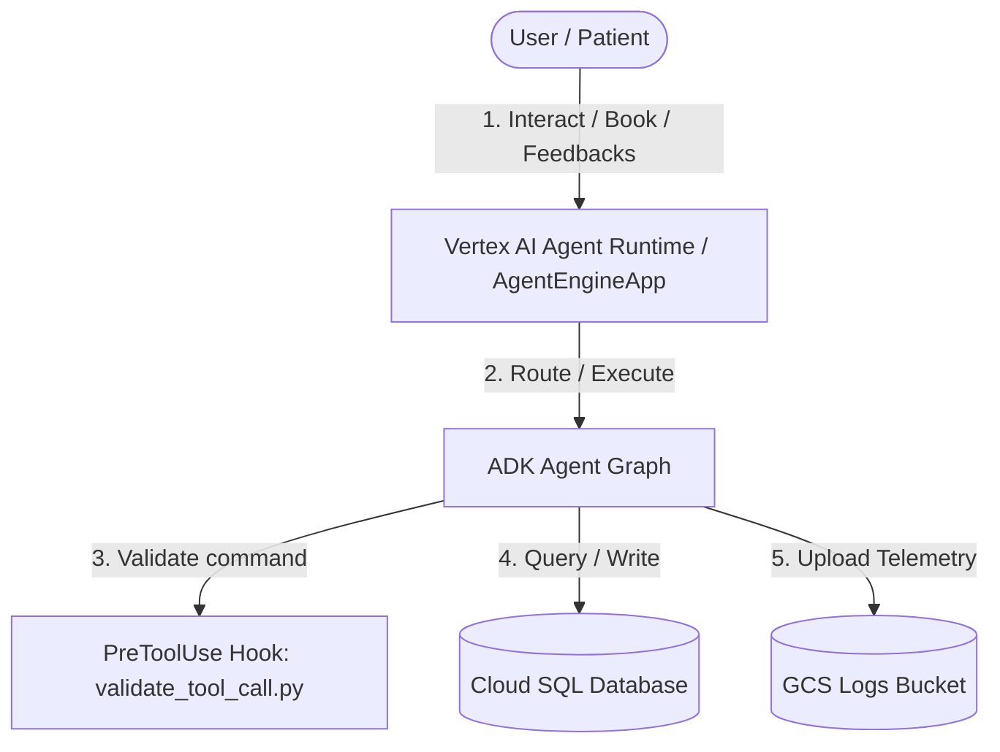

# STRIDE Threat Modeling Assessment: HealthServeAI

This document provides a systematic threat modeling assessment for the **HealthServeAI** agent project based on the STRIDE methodology.

---

## 1. System Boundaries & Data Flow

### Entry Points
1. **AgentEngineApp Interface**: Extends `AdkApp` to run on Vertex AI Agent Runtime. Exposes model generation endpoints, conversation sessions, and a feedback endpoint (`register_feedback`).
2. **Local CLI Execution**: Developers run smoke tests locally via `agents-cli run` or `playground`.

### Data Storage & Infrastructure
- **Cloud SQL**: Stores hospital details, doctor availability, diagnostics lists, and appointments.
- **Google Cloud Storage (GCS)**: Stores prompt-response telemetry logs (metadata only).

---

## 2. STRIDE Pillar Evaluation

### 👤 Spoofing (Identity Spoofing)
- **Threat**: An attacker spoofs a patient or doctor's identity to view, cancel, or modify appointments, or submit fraudulent reviews.
- **Analysis**: The application uses generic UUIDs generated in the `Feedback` model. The ADK agent graph itself does not authenticate callers and relies on the Vertex AI Agent Runtime or hosting application (e.g. Identity-Aware Proxy, Firebase Auth) to verify identities.
- **Mitigation**:
  - The hosting client layer must perform token authentication (e.g., JWT / OAuth2) before passing instructions to the agent.
  - Verification logic should be injected into the session state (`tool_context.state['user_id']`) so that database tools query only records matching the verified caller.

### 📝 Tampering (Data Tampering)
- **Threat**: An attacker manipulates parameters passed to tools (e.g. database query parameters, doctor slot times, or diagnostic fees) to cause unauthorized modifications.
- **Analysis**:
  - Current implementation of `app/agent.py` doesn't yet call Cloud SQL directly.
  - Future database-facing tools are vulnerable to SQL injection if SQL statements are formatted using raw string concatenation.
- **Mitigation**:
  - Enforce strict parameter validation in all tool input parameters using Pydantic schemas.
  - Always use prepared statements/parameterized queries (e.g., SQL binding placeholders `?` or `%s`) rather than raw string execution.

### 🚫 Repudiation
- **Threat**: A patient cancels an appointment but claims they didn't, or a hospital updates slots without logs, leaving no audit trail.
- **Analysis**: The `register_feedback` logs feedback using Google Cloud Logging. General prompt-response logging is configured to upload metadata (with `NO_CONTENT`) to a GCS bucket, meaning the actual conversation content is not retained. There is no transaction-level audit trail for changes to state.
- **Mitigation**:
  - Implement a dedicated database transaction log table for actions like booking, rescheduling, and cancellation, capturing the verified user ID, action, timestamp, and signature/hash of the change.

### 🔒 Information Disclosure
- **Threat**: Patient's Protected Health Information (PHI) or Personally Identifiable Information (PII) is leaked in raw model responses, stack traces, or telemetry logs.
- **Analysis**:
  - Telemetry is configured with `OTEL_INSTRUMENTATION_GENAI_CAPTURE_MESSAGE_CONTENT = NO_CONTENT` by default, protecting patient input privacy.
  - If a tool encounters a database error, uncaught exceptions might bubble up raw SQL strings, table schemas, or database IPs to the LLM and the user.
- **Mitigation**:
  - Wrap all tool execution blocks (especially those querying Cloud SQL) in `try-except` blocks. Sanitise exceptions and return standardized, patient-friendly error descriptions.
  - Integrate PII-redaction filters or standard GCP Sensitive Data Protection (Cloud DLP) if transmitting unstructured text to public endpoints.

### 💥 Denial of Service (DoS)
- **Threat**: An attacker or a rogue agent loop exhausts Google GenAI tokens or database connections, resulting in system downtime and high cloud bills.
- **Analysis**:
  - `Gemini` is configured with default retry options.
  - Multiple concurrent users running large hospital data queries could cause database lockouts or rate limit exhaustion.
- **Mitigation**:
  - Implement rate limiting at the API Gateway layer (requests per minute per user).
  - Define strict execution controls in agent workflows (e.g., specifying low `max_iterations` limits on loop agents, and imposing query timeouts).

### 🔑 Elevation of Privilege
- **Threat**: An attacker tricking the agent into executing arbitrary code, shell commands, or unauthorized GCP API operations on the host environment.
- **Analysis**:
  - The project defines a local pre-commit Semgrep check to block hardcoded API keys in the source tree.
  - We have configured a `PreToolUse` hook in `hooks.json` that executes `validate_tool_call.py` to intercept `run_command` executions and block destructive commands.
- **Mitigation**:
  - The application container should run under a non-root, minimal-permission service account (following the principle of least privilege).
  - Do not register any generic code-interpreter or command-execution tools in the agent's production configuration.

---

## 3. Threat Modeling Roadmap & Next Steps

1. **Database Access Security**: Implement parameterized querying for all Cloud SQL operations.
2. **Access Control**: Configure IAM roles to restrict GCS bucket access (`LOGS_BUCKET_NAME`) and database connections to the running agent service account.
3. **Exception Sanitisation**: Create standard wrapper decorators for agent tools to catch and hide raw error details.
